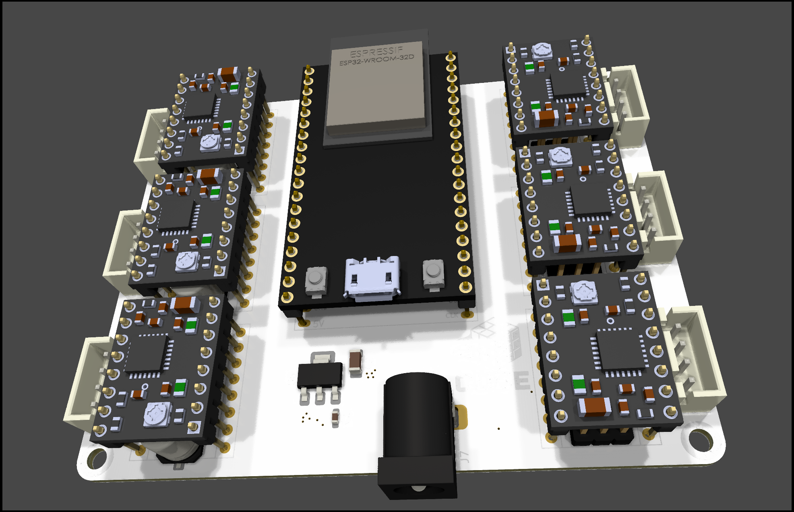

# ESP32 Stepper Motor Shield

## 📌 Board Description
The **ESP32 Stepper Motor Shield** is a custom PCB designed for controlling up to **6 stepper motors** using an ESP32.

### Features
- **6 Stepper Motor Outputs** – Compatible with common driver modules (A4988, DRV8825, TMC series).
- **12V Barrel Jack Input** – Powers all stepper drivers from a single source.
- **Minimal Design** – Compact layout for easy integration into projects.
# ESP32_STEPPER_SHIELD
